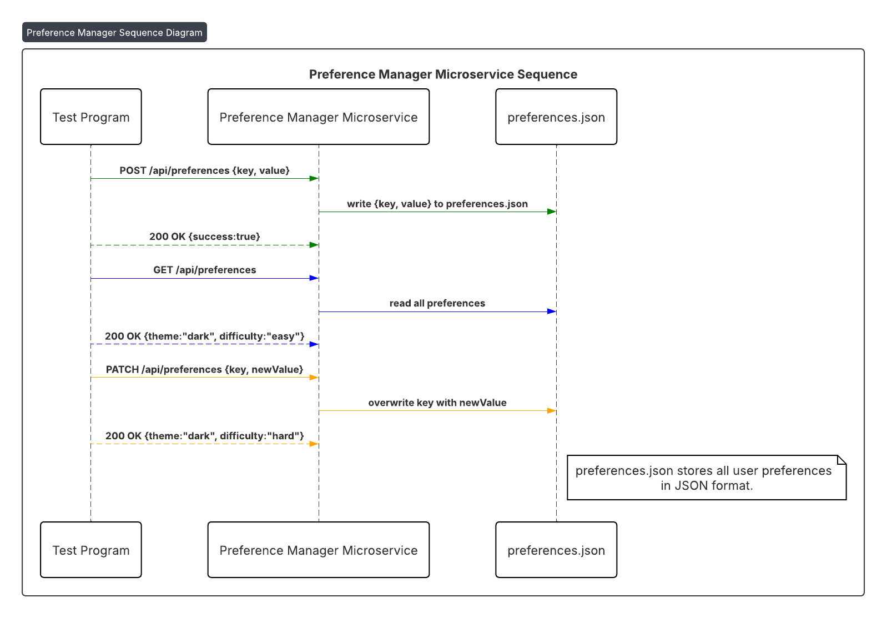

# Preference Manager Microservice — Communication Contract

This microservice stores, retrieves, and updates user preferences (theme, difficulty, notification settings). Once this communication contract is published, it must not change so other services can rely on it.

---

## How to REQUEST Data (Programmatically) 

**HTTP Method:**  
POST / PATCH / GET

**URL:**  
http://localhost:4001/api/preferences

**Required Header:**  
Content-Type: application/json

### Example Request (Node.js / fetch)
// POST - Save preference
await fetch("http://localhost:4001/api/preferences", {
    method: "POST",
    headers: { "Content-Type": "application/json" },
    body: JSON.stringify({ key: "theme", value: "dark" })
});

// GET - Retrieve preferences
const res = await fetch("http://localhost:4001/api/preferences");
const data = await res.json();
console.log(data.theme); // "dark"

// PATCH - Update preference
await fetch("http://localhost:4001/api/preferences", {
    method: "PATCH",
    headers: { "Content-Type": "application/json" },
    body: JSON.stringify({ key: "difficulty", value: "hard" })
});

---

## How to REQUEST Data (Programmatically) 
Expected Successful JSON Response (HTTP 200):

{
  "theme": "dark",
  "difficulty": "easy"
}

Example Usage (Node.js)
const res = await fetch("http://localhost:4001/api/preferences");
const data = await res.json();
console.log("Theme:", data.theme);
console.log("Difficulty:", data.difficulty);

---

## Required Response Format
Field | Type | Description
------|------|------------
theme |string| User-selected theme (dark, light, etc.)
difficulty|string|User-selected difficulty (easy, hard)
notifications|string|Notifications preference (enabled, disabled)

---

## UML Sequence Diagram

